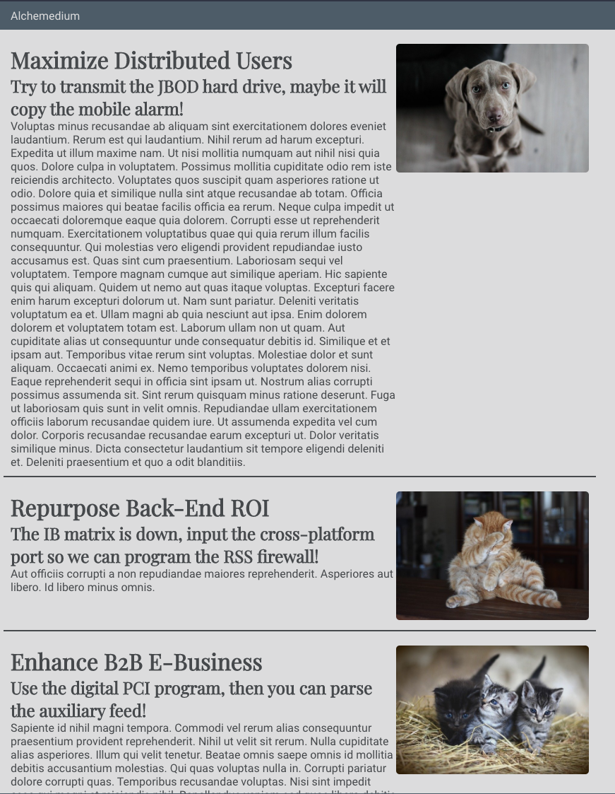

# Making a List of Blogs

_Use [this repository](https://github.com/alchemycodelab/react-blog-list) as a template for this deliverable._
Environment variables have been provided for you because we will all be using the same supabase database. Remove the `.example` from .`env.development.local.example` and `.env.test.local.example`

### Learning Objectives

- Use useEffect hook with a dependency array to retrieve data when a component first mounts
- Use the Supabase Javascript client to retrieve data from a database
- Use useState to manage component state
- Use the network tab to examine (and debug) the request being sent to a server and the response received from a server
- Use the async/await pattern to make our asynchronous code easier to read

### Description

For this deliverable, you will be using supabase to retrieve a list of blogs from an existing database. The table has the following schema:

| blogs      |                   |
| ---------- | ----------------- |
| id         | int - primary key |
| author_id  | int - foreign key |
| created_at | date              |
| title      | varchar           |
| subtitle   | varchar           |
| text       | varchar           |

It will end up looking like this:

### Acceptance Criteria

- A user should see a list of blog posts when they load the page
- App component should have a state variable called `blogs` that defaults to an empty array
- App component should use a `useEffect` hook to call `getBlogs` from the services layer asynchronously and then set the returned data in state
- There should be a function called `getBlogs` in the services layer which calls Supabase and returns all the columns from the `blogs` table
- App component should map through each item in `blogs` and create a `<BlogCard>` component for each blog item
- All existing Snapshot tests should pass without needing to update the snapshot

### Rubric

| Task                                                                                       | Points |
| ------------------------------------------------------------------------------------------ | ------ |
| `blogs` state variable created using `useState` with the proper default                    | 1      |
| `useEffect` correctly calls supabase when the component is first mounted                   | 3      |
| getBlogs function in `services` folder calls Supabase and retrieves the list of blog posts | 3      |
| Supabase code is isolated to the services | 1 |
| each blog is correctly rendered using the `BlogCard` component | 2 |

### Stretch Goals (worth up to 2 additional points)

- The blogs table has a foreign key relationship to a table called authors -- what this means is each author_id on the blogs table matches up with the id of an author
- Read [this](https://supabase.com/docs/reference/javascript/select#query-foreign-tables) documentation on querying foreign tables and see if you can include the author's name in your call to supabase
- Update the BlogCard to include the author's name (you'll need to update the snapshot test when you're done)
